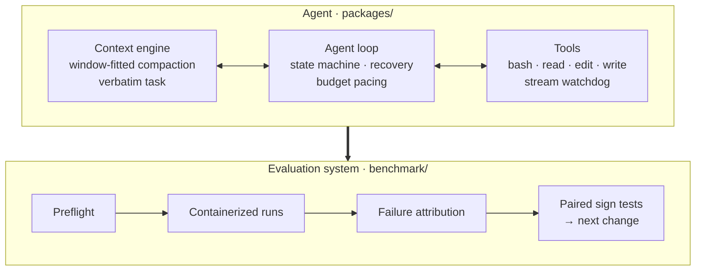

<h1 align="center">Crux</h1>

<p align="center">
  <b>Taking the open-source pi coding agent to Claude Code-level performance on Terminal-Bench — same model weights, re-engineered agent.</b>
</p>

<p align="center">
  
  
  
  
  
  
</p>

<p align="center">
  English · <a href="README.zh-CN.md">简体中文</a>
</p>

---

Crux takes [pi](https://pi.dev), an open-source coding agent, and re-engineers
its agent layer for long-horizon terminal work. On
[Terminal-Bench](https://www.tbench.ai/) 2.1 — 89 real tasks spanning compilers,
emulators, cryptanalysis, ML training and systems administration, each graded by
a hidden test suite inside a container — it lifts pi from **0.539 to 0.773**
pass@1, to the level of Claude Code running the same model (0.730).

The model weights never change. Crux's work is in the agent layer: the loop and
its recovery paths, context management and compaction, tool contracts, and the
runtime that keeps multi-hour runs alive. Every change ships with the
measurement that justified it.

## Highlights

- **pi → Claude Code-level, same weights.** pass@1 from **0.539 to 0.773**
  (+23.4 points) on Terminal-Bench 2.1 with a self-hosted 27B model; Claude Code
  on the same model scores 0.730. Reproduced at 0.793 on an independent run.
- **A context engine that holds up under pressure.** Compaction success taken
  from **14% to 100%**; output truncation cut from **18.0% to 0.7%**; single-task
  sessions summarized in full, with the task's exact wording carried through
  every compaction.
- **Hang-free long runs.** Timed-out trials had been idle for **94%** of their
  wall clock; three root causes found and fixed, taking idle time to **3%**.
- **Statistically rigorous evaluation.** Paired sign tests on concurrently run
  arms, a measured noise floor, and a failure-attribution pipeline that separates
  agent failures from infrastructure failures automatically.
- **Designs proven against data, not adopted on reputation.** Mechanisms from
  Claude Code, Codex, opencode, hermes-agent and grok-build were evaluated
  against 356 trajectories; **34 candidate designs** were ruled out by the
  numbers before any code was written.

## Results

Self-hosted Qwen3.8-27B · the 89 Terminal-Bench 2.1 tasks that run without a GPU
inside the container · 8× agent budget · pass@1 over whole runs.

| Configuration | pass@1 |
|---|---:|
| **Crux** | **0.773** &nbsp;<sub>(0.793 on a second run)</sub> |
| Claude Code, same model | 0.730 &nbsp;<sub>(32K window)</sub> |
| Crux — agent loop and tool contracts only | 0.591 |
| pi, upstream | 0.539 |

**Reproducibility.** Two independent runs of the final configuration scored
0.773 and 0.793. The benchmark's run-to-run variance was measured directly, and
every comparison in this repository is paired task by task to account for it.

## Architecture



## Core engineering

Each capability below is tied to the trajectory evidence that motivated it.
[`benchmark/docs/reference-comparison.md`](benchmark/docs/reference-comparison.md)
maps each one to the reference agent it was drawn from.

### Context engine

| Capability | Evidence |
|---|---|
| Summarization requests sized to the window they live in | History and summary share one window and nothing checked their sum: **2,115 of 2,370 compactions** had been rejected outright. Now 100% succeed |
| Adaptive retry on rejection | Characters per token ranges from 1.95 to 3.99 across real trial text, so a rejected request halves and retries rather than trusting a constant |
| Partial summaries kept | A summary cut at the output cap still carries the work; discarding it disabled compaction on smaller windows |
| Cut-point search that always makes progress | A large trailing tool result no longer leaves the search with nowhere to cut |
| Full summaries for single-task sessions | An agent run on one task is one conversational turn, and every compaction had taken a short turn-fragment path that kept **2,302–4,443 characters of ~250,000 tokens**. Now the full structured summary |
| The task's exact words survive compaction | The original request is carried verbatim and re-read from the session each time, never paraphrased — the approach Codex (openai/codex#48115) and hermes-agent take |

### Liveness and robustness

| Capability | Evidence |
|---|---|
| Stream watchdog | SDK timeouts cover getting a response, not keeping one: **25 timed-out trials had been silent for a median 112 of their 121 minutes** |
| Default command timeout | Ten minutes, chosen from data: 161 commands legitimately ran 2–10 minutes, against 60 runaway ones |
| Process-tree reaping | A detached child writing to an inherited pipe once held a container for **eight hours after 48 seconds of work** |
| Resume after OOM kill | A cgroup OOM kill ends every process in the group; the run now resumes instead of scoring zero |

### Agent loop

| Capability | Evidence |
|---|---|
| Explicit loop state machine | Every recovery path — truncation, budget, escalation — lives in one immutable `LoopState` with explicit limits and a recorded transition reason per turn |
| Two-phase truncation recovery | Raise the output ceiling and retry silently first; speak to the model only if it truncates again — Claude Code's design |
| Reasoning carried across a cut | Reasoning is not replayed between turns, and **292 turns in 60 trials** had ended mid-thought and restarted from scratch. The tail of the reasoning is now handed back |
| Stall detection | A turn that stops inside its reasoning with no answer is treated as a stall, not as completion |
| Escalation for truncated tool calls | **All 42 cut tool calls** had stopped at the initial 16K with the model's own 32K unused; they now get the raised ceiling, as in Claude Code and hermes-agent |
| Budget-aware pacing | The loop sees its deadline, warns before it, and questions a stop while most of the budget is unspent; each task's budget follows its own time limit (80–1,600 minutes) |

### Tools and prompting

| Capability | Evidence |
|---|---|
| Edit failures that show the file | Instead of "must match exactly", a failing edit returns the nearest region of the file by bigram similarity, so the next attempt targets real text |
| Head-and-tail command output | Long output keeps its first lines as well as its last, so the first compiler error survives truncation |
| Visible working notes | The model is told its reasoning is not kept and writes short notes beside tool calls; the median visible text beside a tool call had been **0 characters** |
| Calibrated output ceiling | A per-response default sized from this deployment's own p50/p95/p99 output distribution |

## Evaluation methodology

- **Paired, concurrent comparisons.** Arms are compared task by task with a
  sign test, and only when run in the same time window — run-to-run variance on
  this benchmark is large enough that totals alone mislead.
- **Mechanism health before tuning.** A mechanism's success rate is counted
  before any of its parameters are touched; this is how the compaction failure
  rate was found and fixed.
- **Failure attribution.** A seven-category taxonomy classifies every trial
  automatically and separates the agent's failures from the environment's,
  including verifiers whose own test runners failed to install.
- **Within-task analysis.** For tasks solved in some runs and not others, the
  solved and failed runs are compared directly, which controls for task
  difficulty.
- **Preflight gating.** Every launch is checked for endpoint, launch settings
  and harness checksum before it spends GPU hours.

The full record, including every design evaluated and ruled out, is in
[`benchmark/docs/`](benchmark/docs/README.md).

## Repository layout

```
packages/          the agent: core loop, model layer, tools, CLI (built on pi)
benchmark/         the evaluation system
  src/crux/        harbor agent, prompt sections, failure analysis
  scripts/         launchers, preflight, paired comparison, health checks
  docs/            engineering reports and the design record
  tests/           486 tests
```

## Quick start

```bash
cd benchmark && uv sync
harbor run --dataset terminal-bench/terminal-bench-2-1 \
  --agent crux.pi_agent:CruxPiAgent --model openai/<model>
```

`benchmark/scripts/preflight.sh <launcher>` validates the endpoint, the launch
settings and the harness checksum before a run.
[`benchmark/docs/ENVIRONMENT.md`](benchmark/docs/ENVIRONMENT.md) covers the
evaluation host.

## Acknowledgements

Crux is built on [pi](https://pi.dev) by Earendil Works. Upstream issues and
pull requests belong at
[earendil-works/pi](https://github.com/earendil-works/pi).

| Package | Description |
|---------|-------------|
| **[@earendil-works/pi-coding-agent](packages/coding-agent)** | Coding agent CLI (installs as `crux` and `pi`) |
| **[@earendil-works/pi-agent-core](packages/agent)** | Agent runtime with tool calling and state management |
| **[@earendil-works/pi-ai](packages/ai)** | Unified multi-provider LLM API |
| **[@earendil-works/pi-tui](packages/tui)** | Terminal UI components |
| **[@earendil-works/chord](packages/chord)** | Application-composition runtime for services, RPC and plugins |

Licensed as upstream; see [`LICENSE`](LICENSE).
