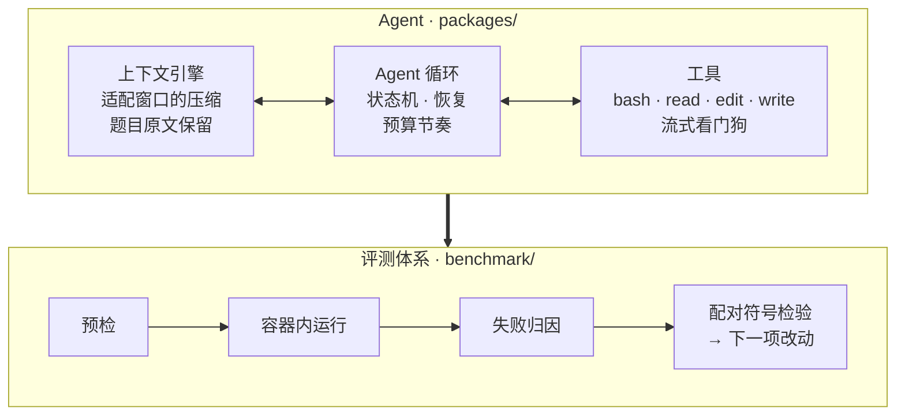

<h1 align="center">Crux</h1>

<p align="center">
  <b>把开源的 pi 编码 Agent 提升到 Claude Code 水平——模型权重不变，重构 Agent 本身。</b>
</p>

<p align="center">
  
  
  
  
  
  
</p>

<p align="center">
  <a href="README.md">English</a> · 简体中文
</p>

---

Crux 以开源编码 Agent [pi](https://pi.dev) 为基础，针对长程终端任务重构了它的
Agent 层。在 [Terminal-Bench](https://www.tbench.ai/) 2.1 上（89 道真实任务，覆盖
编译器、模拟器、密码分析、机器学习训练和系统运维，每道题都在容器内由隐藏测试集
判分），它把 pi 的 pass@1 从 **0.539 提升到 0.773**，达到同一模型下 Claude Code
的水平（0.730）。

模型权重始终不变，提升全部来自 Agent 本身：循环与恢复机制、上下文管理与压缩、
工具契约，以及让数小时长任务稳定运行的运行时。每一项改动都附带支撑它的测量数据。

## 亮点

- **同一权重，从 pi 提升到 Claude Code 水平**：在自部署的 27B 模型上运行
  Terminal-Bench 2.1，pass@1 从 **0.539 提升到 0.773**（+23.4 分）；同一模型下
  Claude Code 为 0.730。独立复跑结果为 0.793。
- **高压下依然可靠的上下文引擎**：上下文压缩成功率从 **14% 提升到 100%**，输出
  截断率从 **18.0% 降到 0.7%**；单任务长会话按完整结构摘要，题目原文在每次压缩
  中一字不改地保留。
- **长时间运行不再挂死**：超时任务原本有 **94%** 的时间处于空转，定位并修复三类
  根因后降到 **3%**。
- **严谨的统计评测**：同时段并发运行、按题配对的符号检验，实测噪声水平，以及自动
  区分 Agent 失败与基础设施故障的失败归因流水线。
- **设计由数据验证，而不是照搬名气**：对照 Claude Code、Codex、opencode、
  hermes-agent、grok-build 的机制，在 356 条执行轨迹上逐项评估，**34 个候选设计**
  在写代码之前就被数据否决。
- **评测吞吐提升 2.8 倍**：全量评测从 6 小时缩短到 2 小时。

## 结果

自部署 Qwen3.8-27B · Terminal-Bench 2.1 中无需 GPU 的 89 道题 · 8 倍 Agent 时间
预算 · 整轮 pass@1。

| 配置 | pass@1 |
|---|---:|
| **Crux** —— 262,144 token 窗口 | **0.773** &nbsp;<sub>（复跑 0.793）</sub> |
| Claude Code，同一模型 | 0.730 &nbsp;<sub>（32K 窗口）</sub> |
| Crux —— 32,768 token 窗口 | 0.678 |
| Crux —— 仅 Agent 循环与工具契约 | 0.591 |
| pi，上游 | 0.539 |

**显著性**：与 32K 配置逐题配对，在两者结果不同的题上 **12 胜 4 负**，符号检验
z = +2.00。最终配置两次独立运行分别为 0.773 和 0.793。我们直接测量了该基准的
跑间波动，仓库中的所有比较都按题配对以消除它的影响。

### 提升来自哪里

| 阶段 | pass@1 | 关键改动 |
|---|---:|---|
| 上游 pi | 0.539 | —— |
| Agent 循环与工具契约 | 0.591 | 截断轮次恢复、循环可见的截止时间、按预算质疑提前停止 |
| 上下文引擎与存活性 | 0.678 | 能装进自身窗口的压缩；流式看门狗、命令超时、进程树回收 |
| 完整上下文窗口与并发调优 | **0.773** | 使用模型原生 262K 上下文替代 32K；吞吐提升 2.8 倍 |

## 架构



## 核心工程

下面每一项能力都对应促成它的轨迹证据。
[`benchmark/docs/reference-comparison.md`](benchmark/docs/reference-comparison.md)
记录了每一项借鉴自哪个参考 Agent。

### 上下文引擎

| 能力 | 证据 |
|---|---|
| 按所在窗口确定摘要请求的大小 | 历史与摘要共用同一个窗口，而原实现从不检查两者之和：**2,370 次压缩中 2,115 次**被直接拒绝。现在 100% 成功 |
| 被拒绝后自适应重试 | 真实轨迹文本的字符/token 比在 1.95 到 3.99 之间，因此请求被拒绝时减半重试，而不是依赖固定常数 |
| 保留未写完的摘要 | 达到输出上限的摘要依然承载了工作进展；丢弃它会让小窗口下的压缩完全失效 |
| 切点搜索始终能推进 | 末尾一条很大的工具结果不再导致无处可切 |
| 单任务会话使用完整摘要 | 单任务运行在对话层面只有"一轮"，原先每次压缩都走简短的"轮次片段"分支，把 **约 25 万 token 的工作压成 2,302–4,443 个字符**。现在使用完整的结构化摘要 |
| 题目原文穿越压缩 | 原始请求每次都从会话记录中重新读取并原样保留，绝不经过转述——与 Codex（openai/codex#48115）和 hermes-agent 的做法一致 |

### 存活性与鲁棒性

| 能力 | 证据 |
|---|---|
| 流式看门狗 | SDK 超时只管"拿到响应"，不管"保持响应"：**25 个超时任务在被杀之前，中位数 121 分钟里有 112 分钟没有任何输出** |
| 默认命令超时 | 由数据确定为 10 分钟：有 161 条命令正常运行了 2–10 分钟，而失控的只有 60 条 |
| 进程树回收 | 一个脱离的子进程向继承的管道持续写入，曾让一道题**在 48 秒工作后占住容器 8 小时** |
| OOM 后续跑 | cgroup OOM 会结束进程组内所有进程；现在会续跑而不是直接记零分 |

### Agent 循环

| 能力 | 证据 |
|---|---|
| 显式循环状态机 | 截断、预算、提额等所有恢复路径统一由不可变的 `LoopState` 管理，每条路径有明确上限，每轮记录状态转移原因 |
| 两段式截断恢复 | 先提高输出上限并静默重试，只有再次截断才告知模型——Claude Code 的设计 |
| 截断后交还思考 | 思考不会在轮次间回传，**60 条轨迹中有 292 轮**在思考中途被截断并从头重来。现在会把思考的末尾交还给模型 |
| 卡住检测 | 停在思考中、没有任何回答的一轮被视为卡住，而不是完成 |
| 工具调用截断后提额 | **42 次被截断的工具调用全部**停在初始的 16K，模型自身的 32K 从未用上；现在同样获得提额，与 Claude Code 和 hermes-agent 一致 |
| 按预算调节节奏 | 循环能看到截止时间，临近时发出提醒，预算大量剩余时质疑提前停止；每道题的预算跟随它自身的时限（80–1,600 分钟） |

### 工具与提示词

| 能力 | 证据 |
|---|---|
| 编辑失败时展示文件内容 | 不再只回复"必须精确匹配"，而是按二元组相似度返回文件中最接近的区域，下一次尝试就能对准真实文本 |
| 命令输出保留首尾 | 长输出同时保留开头和结尾，第一个编译错误不会因截断而丢失 |
| 可见的工作笔记 | 告知模型它的思考不会被保留，让它在工具调用旁写下简短笔记；此前工具调用旁的可见文字中位数为 **0 个字符** |
| 校准的输出上限 | 单次响应的默认上限依据本部署自身的 p50/p95/p99 输出分布确定 |

## 评测方法

- **并发、配对的比较**：实验组之间按题做符号检验，并且只比较同一时间窗内运行的
  组。该基准的跑间波动足够大，只看总分会被误导。
- **先看机制健康度，再调参数**：调整任何参数之前，先统计机制本身的成功率——压缩
  失败率正是这样被发现并修复的。
- **失败归因**：七类失败归因模型自动分类每一条轨迹，区分 Agent 自身的失败与环境
  故障，包括判分器自身测试工具安装失败的情况。
- **同题内对比**：对时成时败的题，直接比较同一道题做对与做错的运行，从而排除题目
  难度的影响。
- **预检闸门**：每次启动前检查端点、启动配置和评测代码校验和，避免浪费 GPU 时间。

完整记录（包括每一个被评估并否决的设计）见
[`benchmark/docs/`](benchmark/docs/README.md)。

## 目录结构

```
packages/          Agent 本体：核心循环、模型层、工具、CLI（基于 pi）
benchmark/         评测体系
  src/crux/        harbor agent、提示词段落、失败分析
  scripts/         启动脚本、预检、配对比较、健康检查
  docs/            工程报告与设计记录
  tests/           486 个测试
```

## 快速开始

```bash
cd benchmark && uv sync
harbor run --dataset terminal-bench/terminal-bench-2-1 \
  --agent crux.pi_agent:CruxPiAgent --model openai/<model>
```

`benchmark/scripts/preflight.sh <launcher>` 会在运行前校验端点、启动配置和评测代码
校验和。[`benchmark/docs/ENVIRONMENT.md`](benchmark/docs/ENVIRONMENT.md) 介绍评测
主机环境。

## 致谢

Crux 基于 Earendil Works 的 [pi](https://pi.dev) 构建。上游的 issue 和 PR 请提交到
[earendil-works/pi](https://github.com/earendil-works/pi)。

| 包 | 说明 |
|---------|-------------|
| **[@earendil-works/pi-coding-agent](packages/coding-agent)** | 编码 Agent CLI（安装为 `crux` 和 `pi`） |
| **[@earendil-works/pi-agent-core](packages/agent)** | 带工具调用与状态管理的 Agent 运行时 |
| **[@earendil-works/pi-ai](packages/ai)** | 统一的多供应商 LLM API |
| **[@earendil-works/pi-tui](packages/tui)** | 终端 UI 组件 |
| **[@earendil-works/chord](packages/chord)** | 面向服务、RPC 与插件的应用组合运行时 |

许可证与上游一致，见 [`LICENSE`](LICENSE)。
