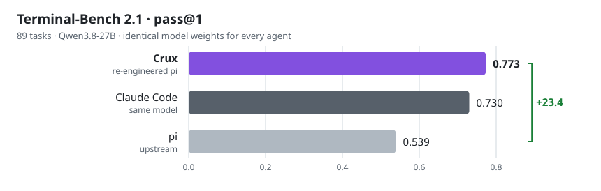

<h1 align="center">Crux</h1>

<p align="center">
  <b>基于 pi 改进的编码 Agent，面向长程终端任务重构。<br/>Terminal-Bench 2.1 pass@1 从 0.539 提升到 0.773，达到同一模型下 Claude Code 的水平。</b>
</p>

<p align="center">
  
  
  
  
</p>

<p align="center">
  <a href="README.md">English</a> · 简体中文
</p>

## 结果

<p align="center">
  <picture>
    <source media="(prefers-color-scheme: dark)" srcset=".github/assets/results-dark.svg">
    
  </picture>
</p>

| Agent | Terminal-Bench 2.1 pass@1 |
|---|---:|
| **Crux** | **0.773** <sub>复跑 0.793</sub> |
| Claude Code，同一模型 | 0.730 <sub>32K 窗口</sub> |
| pi，上游 | 0.539 |

自部署 Qwen3.8-27B，所有 Agent 使用相同权重 · 89 道题 · 整轮 pass@1。

## 相比 pi 的改进

所有改动都在 Agent 层，模型本身不做任何改动。

- **上下文引擎**：压缩请求按窗口大小裁剪，被拒绝时缩小重试，单任务会话使用完整
  结构化摘要，题目原文在每次压缩中原样保留。压缩成功率 **14% → 100%**。
- **Agent 循环**：所有恢复路径统一由显式状态机管理，包括输出截断的两段式恢复、
  截断后交还思考末尾、卡住检测，以及按每道题自身时限调节节奏。输出截断率
  **18.0% → 0.7%**。
- **运行时**：流式空闲看门狗、默认命令超时、进程树回收和 OOM 后续跑，保证数小时的
  长任务稳定运行。超时任务的空转时间占比 **94% → 3%**。
- **工具**：编辑失败时返回文件中最接近的片段，长命令输出同时保留开头和结尾，模型在
  工具调用旁留下简短的可见笔记。

## 评测

[`benchmark/`](benchmark) 是支撑上述结果的评测体系：通过 harbor 在任务容器中运行
Agent，自动归类每条运行的结果，并用配对符号检验逐题比较不同版本。

```bash
cd benchmark && uv sync
harbor run --dataset terminal-bench/terminal-bench-2-1 \
  --agent crux.pi_agent:CruxPiAgent --model openai/<model>
```

## 致谢

基于 Earendil Works 的 [pi](https://pi.dev)
（[earendil-works/pi](https://github.com/earendil-works/pi)）构建。许可证与上游
一致，见 [`LICENSE`](LICENSE)。
